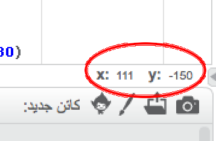

### إحداثيات Scratch

+ في Scratch، يمثل الإحداثيان `x:0, y:0` الموضع المركزي على المنصة.
    
    ويكون الموضع `x:-200, y:-100` ، على سبيل المثال، تجاه أسفل يسار المنصة، بينما يكون الموضع `x:200, y:100` أعلى اليمين تقريبًا.
    
    

+ يمكنك رؤية ذلك بنفسك بإضافة خلفية شبكة الإحداثيين **xy-grid** إلى مشروعك.
    
    

+ لتعرف إحداثيَّي موضع معين، حرٍّك مؤشر الماوس نحو هذا الموضع وتحقق من القراءات الموجودة أسفل الزاوية السفلية اليمنى من المنصة.
    
    