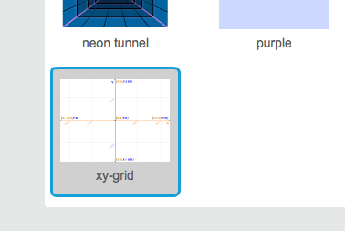

### স্ক্র্যাচ স্থানাঙ্ক

+ স্ক্র্যাচে স্থানাঙ্কের `x:0, y:0` -এই অবস্থা স্টেজের কেন্দ্র চিহ্নিত করে।
    
    স্থানাঙ্কের `x:-200, y:-100` -এই ধরণের মান স্টেজের নিচের বামদিক নির্দেশ করে এবং `x:200, y:100` -এই ধরণের মান উপরের ডানদিক নির্দেশ করে।
    
    

+ আপনার প্রজেক্টের ব্যাকড্রপে **xy-grid** যুক্ত করে আপনি নিজেই দেখতে পারেন।
    
    

+ একটি নির্দিষ্ট অবস্থানের স্থানাঙ্ক খুঁজতে, আপনার মাউস পয়েন্টার সরান এবং স্টেজের ডানদিকে নিচের রিডিংগুলি চেক করুন।
    
    