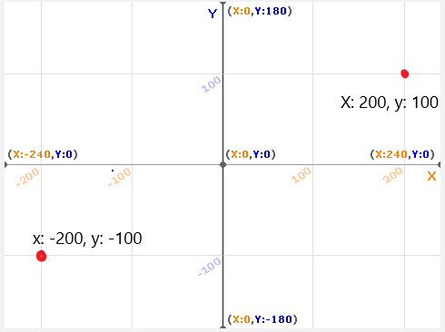
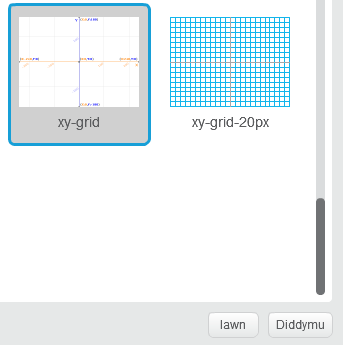
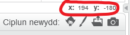

### Cyfesurynnau Scratch

+ Yn Scratch, mae'r cyfesurynnau `x:0, y:0` yn nodi'r lleoliad canolog ar y Llwyfan.
    
    Mae lleoliad fel `x:-200, y:-100` ger cornel chwith isaf y Llwyfan, ac mae lleoliad fel `x:200, y:100` ger y dde uchaf.
    
    

+ Gallwch weld hyn eich hunan gan ychwanegu'r cefndir **xy-grid** i'ch prosiect.
    
    

+ I ddarganfod cydlynu o sefyllfa benodol, symudwch bwyntydd eich llygoden ato a gwirio'r darlleniadau isod yng nghornel dde'r Cam.
    
    