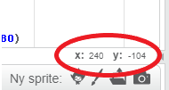

### Ridsekoordinater

+ I bunden markerer koordinaterne `x: 0, y: 0` den centrale position på scenen.
    
    En position som `x: -200, y: -100` er nederst til venstre på scenen, og en position som `x: 200, y: 100` er øverst til højre.
    
    

+ Du kan se dette selv ved at tilføje **xy-grid** baggrunden til dit projekt.
    
    

+ For at finde ud af koordinater for en bestemt position, flyt musemarkøren til den og kontroller aflæsningerne under nederste højre hjørne af scenen.
    
    