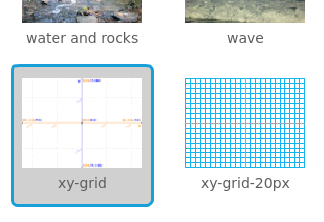
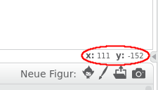

### Scratch-Koordinaten

+ In Scratch markieren die Koordinaten `x: 0, y: 0` die Mitte der Bühne.
    
    Eine Position wie `x: -200, y: -100` ist links unten auf der Bühne und eine Position wie `x: 200, y: 100` ist oben rechts.
    
    

+ Du kannst das selbst sehen, indem du das Bühnenbild **xy-grid** zu deinem Projekt hinzufügst.
    
    

+ Um die Koordinaten einer bestimmten Position herauszufinden, bewege den Mauszeiger darauf und sieh auf die Werte unterhalb der unteren rechten Ecke der Bühne.
    
    