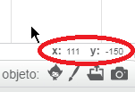

### Coordenadas en Scratch

+ En Scratch, las coordenadas `x:0, y:0` indican la posición central en el escenario.
    
    Una posición como `x:-200, y:-100` está cerca de la parte inferior izquierda del escenario, y una posición como `x:200, y:100` está cerca de la parte superior a la derecha.
    
    

+ Puedes ver esto tú mismo añadiendo el fondo **xy-grid** a tu proyecto.
    
    

+ Para averiguar las coordenadas de una posición específica, mueve el puntero del ratón hasta ella y observa lo que se indica debajo de la esquina inferior derecha del escenario.
    
    