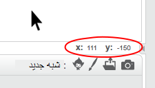

### مختصات اسکرچ

+ در اسکرچ، مختصات `x: 0، y: 0` موقعیت مرکزی را در صحنه مشخص می‌کند.
    
    یک موقعیت مانند `x: -200، y: -100` در سمت پایین سمت چپ صحنه است و موقعیتی مانند `x: 200، y: 100` در سمت راست بالا قرار دارد.
    
    

+ شما می توانید این را با اضافه کردن پشت صحنه‌ی **xy-grid** به پروژه‌ی خود مشاهده کنید.
    
    

+ برای پیدا کردن مختصات یک موقعیت خاص، اشاره‌گر ماوس خود را به آن موقعیت حرکت دهید و نوشته‌های گوشه‌ی سمت راست پایین صحنه را ببینید.
    
    