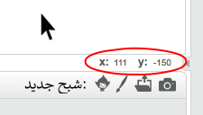

### مختصات خراش

+ در ابتدا، مختصات `x: 0، y: 0` علامت موقعیت مرکزی در مرحله است.
    
    یک موقعیت مانند `x: -200، y: -100` به سمت پایین سمت چپ در مرحله است، و موقعیتی مانند `x: 200، y: 100` در سمت راست بالا قرار دارد.
    
    

+ شما می توانید این را برای خودتان با اضافه کردن پس زمینه **xy-grid** به پروژه خود مشاهده کنید.
    
    

+ برای پیدا کردن مختصات یک موقعیت خاص، اشارهگر ماوس خود را به آن حرکت دهید و قرائتهای زیر گوشه پایین سمت راست صحنه را بررسی کنید.
    
    