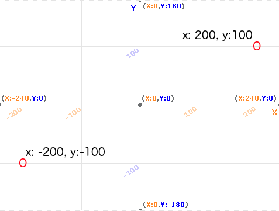
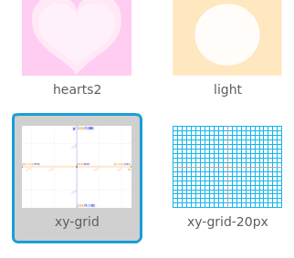
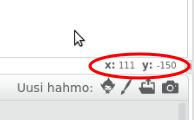

### Scratch koordinaatit

+ Scratchissa koordinaatit `x: 0, y: 0` merkitsevät esiintymislavan keskipistettä.
    
    SIjainti kuten `x: -200, y: -100` on esiintymislavan vasemmassa alareunassa ja sijainti kuten `x: 200, y: 100` on lähellä oikeaa yläkulmaa.
    
    

+ Voit nähdä tämän lisäämällä **xy-grid** -taustakuvan projektiin.
    
    

+ Jos haluat selvittää tietyn sijainnin koordinaatit, siirrä hiiren osoitin siihen ja tarkista esiintymislavan oikean alakulman alla olevat lukemat.
    
    