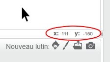

### Les coordonnées dans Scratch

+ Dans Scratch, les coordonnées `x: 0, y: 0` marquent la position centrale sur la scène.
    
    Une position comme `x: -200, y: -100` est vers le bas à gauche sur la scène, et une position comme `x: 200, y: 100` est près du coin supérieur droit.
    
    

+ Vous pouvez le voir par vous-même en ajoutant le **xy-grid** toile de fond à votre projet.
    
    

+ Pour trouver les coordonnées d'une position spécifique, déplacez le pointeur de la souris vers celle-ci et vérifiez les mesures situées en bas à droite de la scène.
    
    