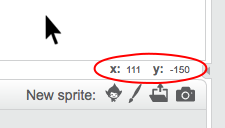

### Scratch निर्देशांक

+ Scratch में, निर्देशांक `x:0, y:0`, मंच पर केंद्रीय स्थिति बताता है ।
    
    एक स्थिति जैसे `x:-200, y:-100` मंच के नीचे बाएँ की ओर है तथा एक स्थिति जैसे `x:200, y:100` मंच के ऊपर दांए की ओर हैं ।
    
    

+ आप इसे **xy-grid** पृष्ठभूमि को जोड़ कर स्वयं देख सकते है ।
    
    

+ एक स्थिति का निर्देशांक ढूँढ़ने के लिए, अपने माउस को स्थिति की ओर बढाईये तथा मंच के नीचे दाएं ओर लिखे गए अंको को पढ़िए ।
    
    