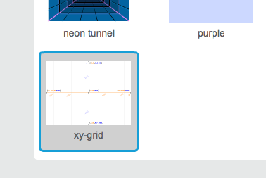

### Scratch निर्देशांक

+ Scratch में, निर्देशांक `x:0, y:0`, मंच पर केंद्रीय स्थिति बताता है ।
    
    A position like `x:-200, y:-100` is towards the bottom left on the Stage, and a position like `x:200, y:100` is near the top right.
    
    

+ You can see this for yourself by adding the **xy-grid** backdrop to your project.
    
    

+ To find out coordinates of a specific position, move your mouse pointer to it and check the readings below the bottom right corner of the Stage.
    
    