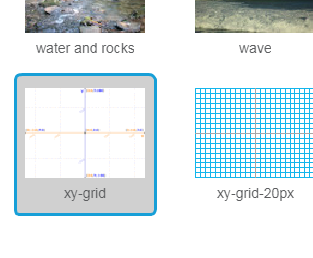
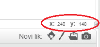

### Koordinate u Scratchu

+ U Scratchu, koordinate `x:0, y:0` označavaju središnji položaj na Pozornici.
    
    Pozicija poput `x:-200, y:-100` nalazi se u donjem lijevom dijelu Pozornice, a pozicija poput `x:200, y:100` u gornjem desnom dijelu.
    
    

+ To možeš vidjeti sam dodavanjem **xy-grid** pozadine svom projektu.
    
    

+ Da bi saznao koordinate određenog položaja, pomakni pokazivač miša na njega i pročitaj što piše ispod donjeg desnog kuta Pozornice.
    
    