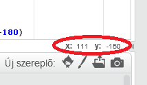

### Scratch koordináták

+ A Scratchben a `x: 0, y: 0` koordináták a játéktér középpontját jelzik.
    
    Egy olyan pozíció, mint a `x: -200, y: -100`, a játéktér bal alsó részen, a `x: 200, y: 100` pozíció pedig a jobb felső részén található.
    
    

+ Ezt saját magad is láthatod, ha hozzáadod az **xy-grid** hátteret a projektedhez.
    
    

+ Ha meg szeretnéd tudni egy adott pozíció koordinátáit, vidd oda az egérmutatót, majd nézd meg a koordinátákat a játéktér jobb alsó sarkában.
    
    