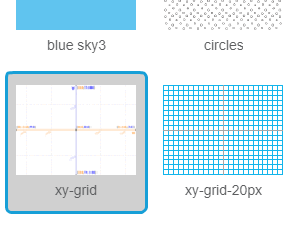

### Koordinat Scratch

+ Dalam Scratch, koordinat `x: 0, y: 0` menandai posisi tengah pada Stage.
    
    Posisi seperti `x: -200, y: -100` mengarah ke bagian kiri bawah pada Stage, dan posisi seperti `x: 200, y: 100` berada di dekat kanan atas.
    
    

+ Kamu dapat melihatnya sendiri dengan menambahkan latar **xy-grid** ke proyek mu.
    
    

+ Untuk mengetahui posisi tertentu dari koordinat, gerakkan pointer mouse Kamu ke posisi tersebut dan periksa bacaan di sudut bawah kanan bawah Stage.
    
    