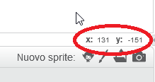

### Coordinate di Scratch

+ In Scratch, le coordinate `x: 0, y: 0` segnano la posizione centrale sullo stage.
    
    La posizione `x: -200, y: -100` indica l'area dello stage in basso a sinistra; la posizione `x: 200, y: 100` indica l'area in alto a destra.
    
    

+ Puoi fare pratica aggiungendo lo sfondo **xy-grid** al tuo progetto.
    
    

+ Per trovare le coordinate di una posizione specifica, muovi il puntatore del mouse sul punto di cui vuoi scoprire le coordinate e dai un'occhiata all'angolo in basso a destra dello stage.
    
    