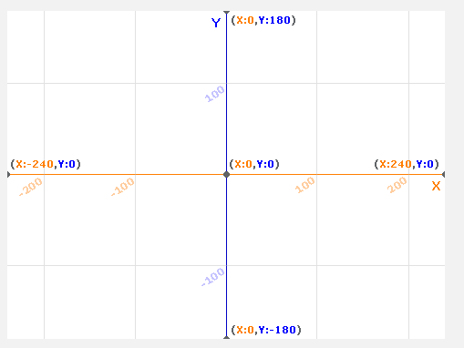
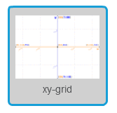
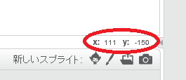

### Scratch (スクラッチ) の座標 (ざひょう)

+ スクラッチでは、座標 `x:0, y:0` がステージ上の中心位置をしめします。
    
    `x：-200、y：-100` のような位置はステージの左下にあり、 `x：200、y：100` のような位置は右上にあります。
    
    

+ プロジェクトに **xy-grid** の背景を追加すると、これを自分で見ることができます。
    
    

+ 特定の位置の座標を確認するには、マウスポインターをその位置に移動し、ステージの右下隅に表示された値を確認します。
    
    