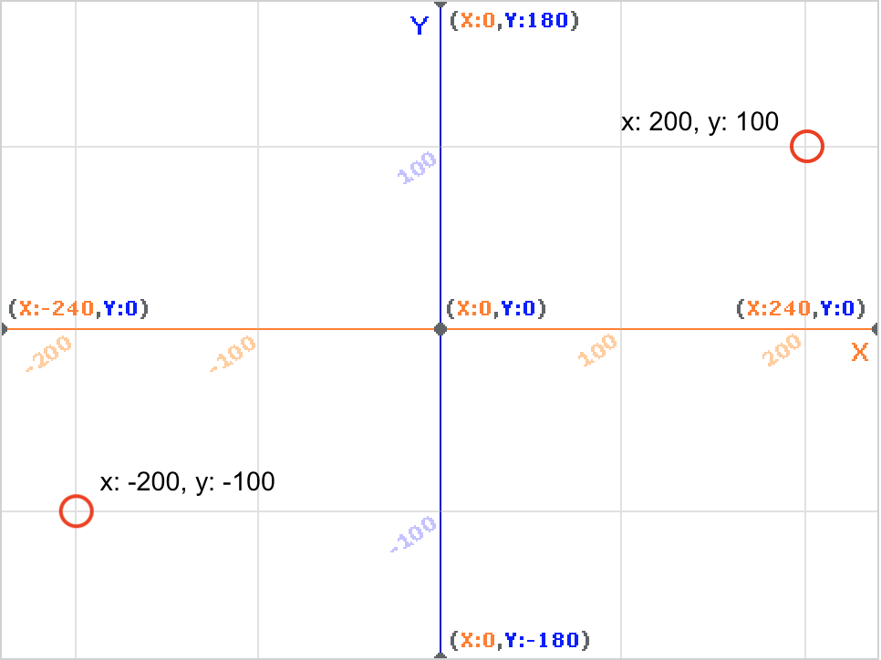
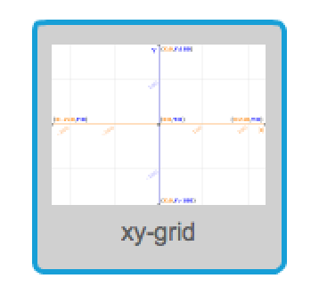
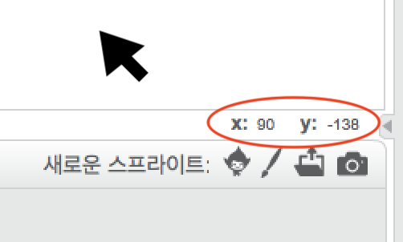

### 스크래치 좌표

+ Scratch에서 `x : 0, y : 0` 좌표는 스테이지에서 중앙 위치를 표시합니다.
    
    `x : -200, y : -100` 과 같은 위치가 스테이지의 왼쪽 하단을 향하고 `x : 200, y : 100` 과 같은 위치가 오른쪽 상단 근처에 있습니다.
    
    

+ 프로젝트에 **xy-grid** 배경을 추가하여 직접 볼 수 있습니다.
    
    

+ 특정 위치의 좌표를 찾으려면 마우스 포인터를 해당 위치로 이동하고 스테이지의 오른쪽 하단 모서리 아래의 판독 값을 확인하십시오.
    
    