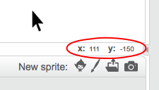

### Koordinate u Scratch-u

+ U Scratch-u, koordinate `x:0, y:0` označavaju centralnu poziciju na Pozornici.
    
    Pozicija kao što je `x:-200, y:-100` nalazi se u donjem lijevom dijelu Pozornice, a pozicija kao što je `x:200, y:100` u gornjem desnom dijelu.
    
    

+ To možeš sam/sama da vidiš kada dodaš pozadinu **xy-grid** u svoj projekat.
    
    

+ Da saznaš koordinate određene pozicije, pomjeri pokazivač miša do tog mjesta i pročitaj vrijednosti ispod donjeg desnog ugla Pozornice.
    
    