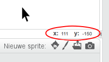

### Scratch coördinaten

+ In Scratch markeren de coördinaten `x: 0, y: 0` het midden van het speelveld.
    
    Een positie als `x: -200, y: -100` bevindt zich linksonder in het speelveld en een positie als `x: 200, y: 100` bevindt zich in de rechterbovenhoek.
    
    

+ Je kunt dit zelf zien door de achtergrond **xy-grid** uit de bibliotheek toe te voegen aan je project.
    
    

+ Om de coördinaten van een bepaalde positie te achterhalen, beweeg je de muisaanwijzer ernaar en bekijk je de metingen rechts onder het speelveld.
    
    