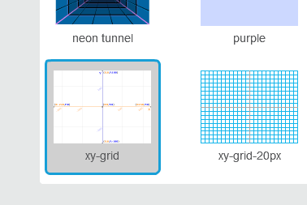
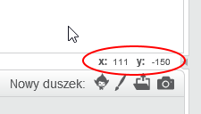

### Współrzędne w Scratchu

+ W Scratchu współrzędne `x: 0, y: 0` oznaczają centralną pozycję na scenie.
    
    Pozycja taka jak `x: -200, y: -100` znajduje się w lewym dolnym rogu sceny, a pozycja taka jak `x: 200, y: 100` znajduje się w prawym górnym rogu.
    
    

+ Możesz to samemu zobaczyć, dodając do projektu tło **xy-grid**.
    
    

+ Aby znaleźć współrzędne określonej pozycji, należy przesunąć na nią wskaźnik myszy i sprawdzić odczyty poniżej prawego dolnego rogu sceny.
    
    