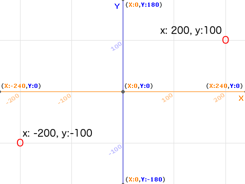
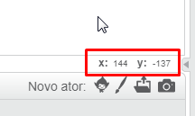

### Coordenadas no Scratch

+ No Scratch, as coordenadas `x: 0, y: 0` marcam a posição central no palco.
    
    A posição com as coordenadas `x: -200, y: -100` esta localizada no canto inferior esquerdo do palco, e a posição `x: 200, y: 100` está localizada no canto superior direito.
    
    

+ Você pode visualizar as coordenadas ao adicionar o pano de fundo **xy-grid** ao seu projeto.
    
    

+ Para descobrir as coordenadas de uma posição específica, mova o ponteiro do mouse até o local desejado e verifique as leituras abaixo do canto inferior direito do palco.
    
    