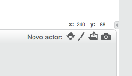

### Coordenadas de rascunho

+ Em Scratch, as coordenadas `x: 0, y: 0` marcam a posição central no palco.
    
    Uma posição como `x: -200, y: -100` é para o canto inferior esquerdo no palco, e uma posição como `x: 200, y: 100` está perto da parte superior direita.
    
    

+ Você pode ver isso por si mesmo adicionando o pano de fundo **xy-grid** ao seu projeto.
    
    

+ Para descobrir as coordenadas de uma posição específica, mova o ponteiro do mouse para ele e verifique as leituras abaixo do canto inferior direito do palco.
    
    