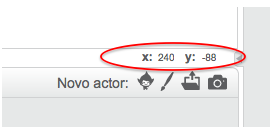

### Coordenadas no Scratch

+ No Scratch, as coordenadas `x: 0, y: 0` marcam a posição central no palco.
    
    Uma posição do género `x: -200, y: -100` fica na regiāo inferior esquerda do palco, e uma posição como `x: 200, y: 100` está perto da parte superior direita.
    
    

+ Podes ver isso mesmo adicionando o pano de fundo **xy-grid** ao teu projeto.
    
    

+ Para descobrir as coordenadas de uma posição específica, move o ponteiro do rato para essa posição e verifica as leituras por baixo do canto inferior direito do palco.
    
    