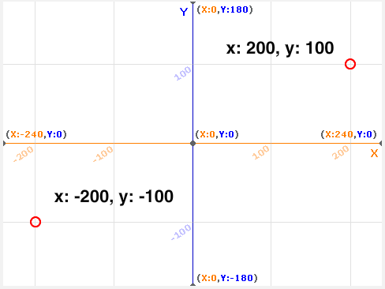
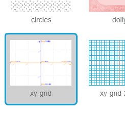
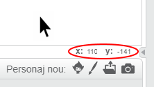

### Coordonate Scratch

+ În Scratch, coordonatele `x: 0, y: 0` marchează poziția centrală a scenei.
    
    O poziție ca `x: -200, y: -100` este spre partea din stânga-jos a scenei, iar o poziție ca `x: 200, y: 100` este aproape de partea din dreapta-sus.
    
    

+ Puteți vedea și dvs. acest lucru prin adăugarea fundalului **xy-grid** la proiect.
    
    

+ Pentru a afla coordonatele unei anumite poziții, deplasați indicatorul mouse-ului deasupra ei și verificați ce este afișat în colțul din dreapta jos al scenei.
    
    