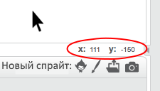

### Координаты Scratch

+ В Scratch точка начала координат `x: 0, y: 0` расположена в центре сцены.
    
    Координаты вроде `x: -200, y: -100` соответствуют левому нижнему углу сцены, а координаты `x: 200, y: 100` соответствуют правому верхнему углу.
    
    

+ Ты можешь убедиться в этом самостоятельно, добавив в свой проект задник **xy-grid**.
    
    

+ Чтобы узнать координаты конкретной позиции, перемести на неё указатель мыши и посмотри на цифры в правом нижнем углу сцены.
    
    