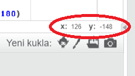

### Scratch koordinatları

+ Scratch'ta, `x: 0, y: 0` koordinatları, Sahne Alanı üzerindeki merkezi konumu işaretler.
    
    `x: -200, y: -100` gibi bir konum, Sahne Alanı'nın sol alt köşesine doğru ve `x: 200, y: 100` gibi bir konum sağ üst tarafa doğrudur.
    
    

+ Projenize **xy-grid** zemini ekleyerek bunu kendiniz görebilirsiniz.
    
    

+ Belirli bir konumun koordinatlarını bulmak için, fare imlecinizi hareket ettirin ve Sahne Alanı'nın sağ alt köşesinin altındaki okumaları kontrol edin.
    
    