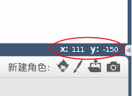

### Scratch 坐标

+ 在Scratch中，坐标`x:0,y:0`标识除了舞台的中央位置。
    
    像`x:-200,y:-100`这样的坐标指向舞台的左下方，像`x:200,:y,100`这样的坐标在右上方附近。
    
    

+ 你可以通过添加**xy-grid**背景到项目中来查看
    
    

+ 要找出某个对象的特定位置的坐标，移动鼠标指针到它身上，查看在舞台窗口右下角的读数。
    
    